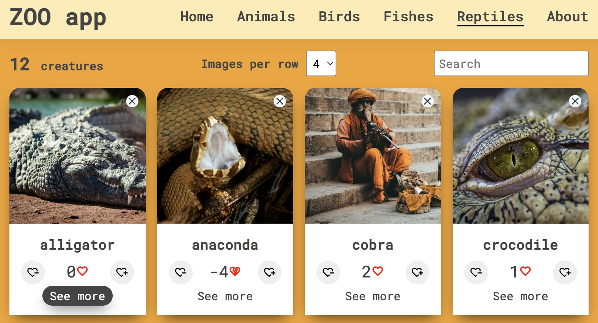

# Zoo app

## General Information

Zoo app project for ReactJS course at Business College Helsinki in November 2023.
Animal images displayed by a category, sourced from [Unsplash](https://unsplash.com/)

## Technologies Used

ReactJS, HTML, CSS

## Features

- likes/dislikes
- delete images
- see a single animale page
- options on number of images per row

## Screenshot

## 

## 

## 

### **Check it out!**

[Zoo app](https://incredible-youtiao-5a49dc.netlify.app)
